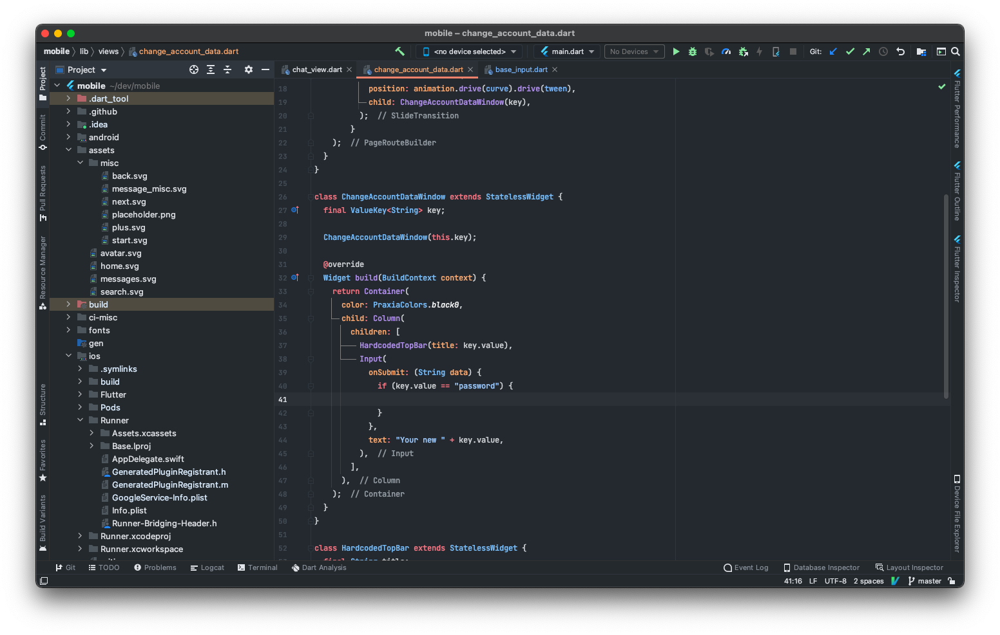

# GitHub IntelliJ IDEA theme
## NOTE: Required 2019.2 release

Based on GitHub Dark theme from [Material Theme](https://github.com/ChrisRM/material-theme-jetbrains) plugin

## TODO: 
 - Fix miscellaneous problems with UI 
 - Make GitHub Light theme 
